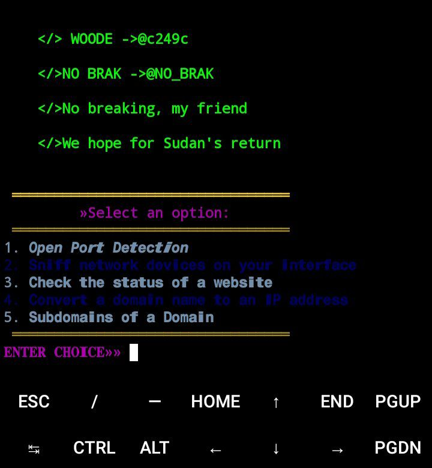

# Security-threat
SECURITY THREAT 👨🏽‍💻

Script Description:

This script is a multi-functional network and domain utility tool written in Python. It provides several useful features for network analysis, domain inspection, and testing. Below is a detailed description of each feature:

[My channel Telegram](https://t.me/NO_BRAK)

---

Features and Options:

1. Open Port Detection

Description: Scans for open ports on a specified IP address within a range (default: 1 to 1024). This feature helps in identifying which services are accessible on a target system.

Use Case: Useful for testing the security of a system by determining exposed ports.

2. Network Device Sniffing

Description: Scans the local network to identify connected devices by their IP and MAC addresses.

Use Case: Helpful for network administrators to monitor devices on the network and detect unauthorized connections.

3. Website Status Check

Description: Checks the availability and status of a given website by sending an HTTP request and returning the status code (e.g., 200 for success).

Use Case: Useful for ensuring that a website is online and responding correctly.

4. Domain-to-IP Conversion

Description: Resolves a domain name (e.g., google.com) to its corresponding IP address using DNS lookup.

Use Case: Helps in troubleshooting DNS issues or understanding the underlying IP address of a domain.

5. Subdomain Extraction and Saving

Description: Attempts to discover subdomains of a given domain by testing common subdomain names (e.g., www, mail, api). The discovered subdomains are saved to a file named woode.txt.

Use Case: Useful for penetration testing and identifying additional entry points on a domain.

---

How to Use the Script:

1. Run the script using Python.

2. Choose an option from the menu by entering the corresponding number.

3. Follow the prompts to provide the required input (e.g., IP address, domain name).

4. The script will perform the selected task and display the results.

Note: This script is intended for educational and legal use only. Always ensure you have permission before testing networks or domains.
